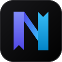

# NTab

<p align="center">
  
</p>

<p align="center">
  <strong>Modern, Ultra-Fast & Highly Customizable New Tab Extension with Smart Multi-Column Bookmark Management</strong>
</p>

<p align="center">
  <a href="https://github.com/noby338/ntab/blob/main/LICENSE"></a>
  <a href="https://vuejs.org/"></a>
  <a href="https://wxt.dev/"></a>
  <a href="https://tailwindcss.com/"></a>
  <a href="https://www.typescriptlang.org/"></a>
</p>

---

## 🌟 Highlights & Features

- 📑 **Smart Multi-Column Bookmark Layout**: Reorganize your bookmarks into customizable, responsive columns with intuitive drag-and-drop operations (inter-column slots, vertical card slots, and folder nesting).
- ⚡ **Ultra-Compact High-Density Mode**:
  - Dynamically scale font size (8px~32px) and row height (12px~64px) with continuous linear responsiveness.
  - Option to hide bookmark icons for distraction-free pure-text typography with clean single-line ellipsis truncation.
  - Top-pinned cards with an auto-revealing quarter-circle corner trigger for zero wasted screen space.
- 🔍 **Instant Web Search with Quick Switcher**:
  - Built-in authentic vector logos for Google, Baidu, Bing, Bilibili, GitHub, and DuckDuckGo.
  - Switch search engines instantly with numeric shortcuts (`Alt + 1~6` globally or `1~6` in the search bar).
  - Add and manage custom search engines with `%s` query template support.
- 🩺 **Lightweight Dead-Link Health Check**:
  - Zero-bandwidth `HEAD`-first probe with automated 1KB `GET` fallback.
  - Strict segregation between **404 Page Not Found** and **403 Access Forbidden / WAF** to prevent accidental deletions.
  - Reusable confirmation dialog for selective one-click batch removal.
- ☁️ **Google Account Cloud Sync**:
  - Fully functional offline without login.
  - Optional Google Sign-In using hidden **Google Drive AppData folder** (`drive.appdata`) for seamless cross-device layout and setting restoration.
  - Zero backend server required, 100% private to your personal Google account.
- 🎨 **8 Elegant Built-in Themes**:
  - System (Auto day/night), Light, Cream (Warm Paper), Sepia (Retro Study), Dark, Nord (Arctic Blue), Catppuccin (Mocha), and Tokyo Night (Cyberpunk).
  - Custom CSS injection support for advanced customization.
- 🌍 **Internationalization (i18n)**:
  - 9 localized languages: English, 简体中文, 繁體中文, 日本語, 한국어, Deutsch, Español, Français, and Русский.

---

## 🚀 Tech Stack

- **Extension Framework**: [WXT](https://wxt.dev/) (Vite 8-based WebExtension framework, Manifest V3)
- **Frontend Framework**: [Vue 3](https://vuejs.org/) (Composition API, `<script setup lang="ts">`)
- **Styling**: [Tailwind CSS v4](https://tailwindcss.com/) with `@tailwindcss/vite`
- **Type Safety**: [TypeScript](https://www.typescriptlang.org/) + `vue-tsc`
- **Iconography**: `@lucide/vue` + Official SVG brand assets

---

## 🛠️ Getting Started & Local Development

### Prerequisites

- Node.js `v18.0.0` or later
- npm, pnpm, or bun

### 1. Clone the repository

```bash
git clone https://github.com/noby338/ntab.git
cd ntab
```

### 2. Install dependencies

```bash
npm install
```

### 3. Start development server

```bash
npm run dev
```

WXT will launch an isolated browser instance with hot module replacement (HMR).

### 4. Build for production

```bash
# Build for Chrome (Manifest V3)
npm run build

# Build for Firefox (Manifest V2/V3)
npm run build:firefox

# Generate packaged zip file
npm run zip
```

The production output will be generated in `.output/chrome-mv3`.

### 5. Load in Chrome / Edge / Brave

1. Open your browser and navigate to `chrome://extensions/`.
2. Enable **Developer mode** in the top right corner.
3. Click **Load unpacked** and select the `.output/chrome-mv3` directory.
4. Open a new tab to enjoy NTab!

---

## ⌨️ Default Keyboard Shortcuts

| Shortcut (Mac) | Shortcut (Win/Linux) | Action |
| --- | --- | --- |
| `/` | `/` | Focus search bar |
| `Tab` | `Tab` | Cycle search engine (when input empty) |
| `⌥ 1` | `Alt + 1` | Switch to Google |
| `⌥ 2` | `Alt + 2` | Switch to Baidu |
| `⌥ 3` | `Alt + 3` | Switch to Bing |
| `⌥ 4` | `Alt + 4` | Switch to Bilibili |
| `⌥ 5` | `Alt + 5` | Switch to GitHub |
| `⌥ 6` | `Alt + 6` | Switch to DuckDuckGo |
| `⌥ N` | `Alt + N` | New root folder |
| `⌥ B` | `Alt + B` | Toggle batch selection mode |
| `⌥ H` | `Alt + H` | Open dead-link health check |
| `⌥ S` | `Alt + S` | Open settings modal |
| `Esc` | `Esc` | Close modals / clear selection |

*All shortcuts can be fully customized and recorded in **Settings -> Shortcuts**.*

---

## ☕ Support & Sponsorship

If NTab improves your daily browsing workflow and productivity, consider supporting the creator:

- **PayPal**: [Donate with PayPal](https://www.paypal.com/ncp/payment/AKBZ3BM5368R8?item_name=Support%20NTab%20Extension&custom=ntab)
- **Ko-fi**: [Tip on Ko-fi](https://ko-fi.com/nobytan?ref=ntab)
- **WeChat Pay / Alipay**: Available via the in-app Support tab in Settings.

---

## 📄 License

This project is open source and available under the [MIT License](LICENSE).
